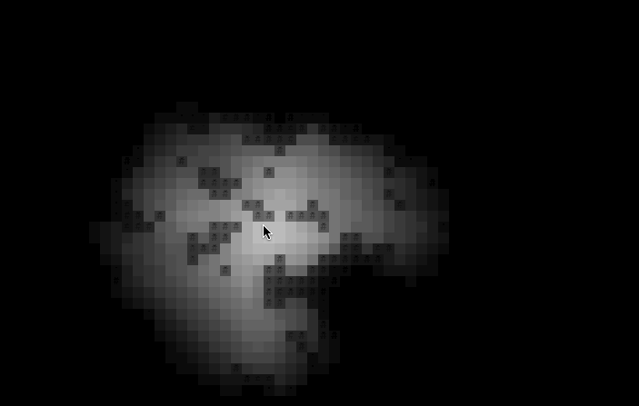
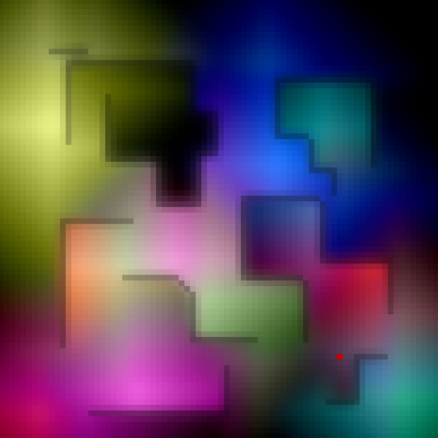

# LightMask

A 2d flood-fill lighting engine



  

*Full-color lighting can be achieved by using a separate LightMask for each color channel or by adjusting the computations to use 3 channels instead of 1.*

# Running the demo

The demo requires SDL2 to run. The LightMask engine itself has no external dependencies.

```
git clone https://github.com/nick-paul/LightMask.git
cd LightMask
mkdir build
cd build
cmake ..
make
./demo
```

# How to use

### Initilize LightMask and variables

```c++
    // The lightmask itself
    LightMask lightmask(WIDTH, HEIGHT);
    // Intensity: Proportional to how far light spreads
    lightmask.setIntensity(40.0f);
    // Ambient: Ambient light (0.0f - 1.0f)
    lightmask.setAmbient(0.4f);

    // Vector representing wall opacities (1.0: solid, 0.0: clear)
    // Stored in a single dimensional vector
    // To set a wall value at (x,y) use walls[x + WIDTH * y] = ...
    std::vector<float> walls(WIDTH * HEIGHT, 1.0f);
```

### Adding lights and computing the mask

```c++
    // Reset the light mask
    // Must be called every frame
    lightmask.reset();

    // All lights must be added between `reset()` and `computeMask()`
    // Add a light with given brightness at location (x,y)
    // brightness: 0.0 = no light, 1.0f = full light
    lightmask.addLight(x, y, brightness);

    // Compute the mask
    // Pass the `walls` vector to the compute function
    lightmask.computeMask(walls);
```

### Rendering

Assume we are using the following to represent a `Color` object where each channel is a value from `0.0` to `1.0`

```c++
    struct Color {
        float r;
        float g;
        float b;
    }
```

To compute the color of a tile at location `(x,y)` for rendering, multiply the color channels by the light mask at that location

```c++
    // Assume the call `map.getTileColor(x,y)`
    // gets the color of the map tile at location (x,y)
    Color color = map.getTileColor(x,y);

    // Multiply each of the channels by the light mask
    // 0.0: dark, 1.0: bright
    float tile_brightness = lightmask.mask[x + y * width];
    Color lighting_color(
        color.r * tile_brightness,
        color.g * tile_brightness,
        color.b * tile_brightness
    );

    // Render the tile with the new color
    // Assume `render()` takes an object to render and a color to render it
    // render(object, color)
    render(map.getTile(x, y), lighting_color);
```

# Limitations

  - This was originally developed for a roguelike engine so framerate and performance were not a huge concern. If you have any performance improving ideas, submit an issue or a PR and I'd be happy to take a look.
  - Currently, the blur function creates a black border of unlit tiles on the outer edges of the map. To avoid this, don't use the blur function or make the lightmask slightly larger than the renderer size.


